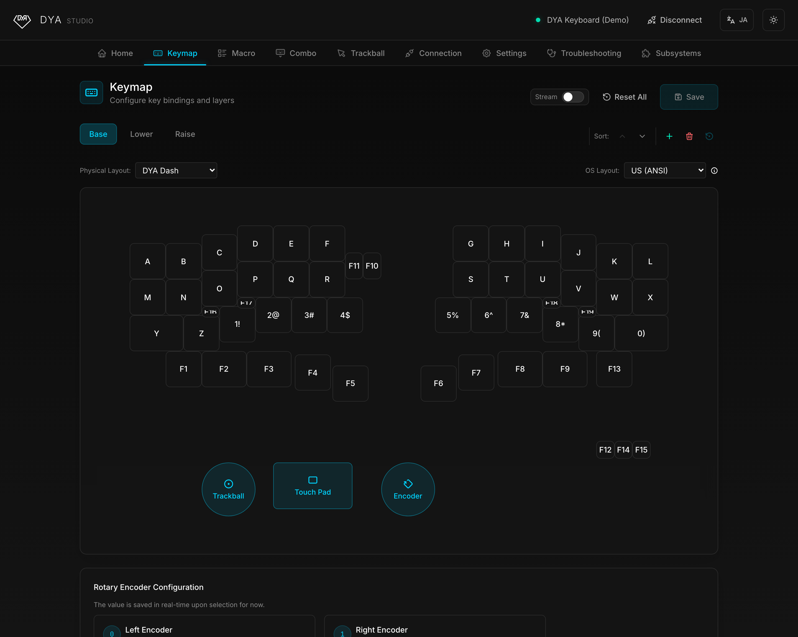
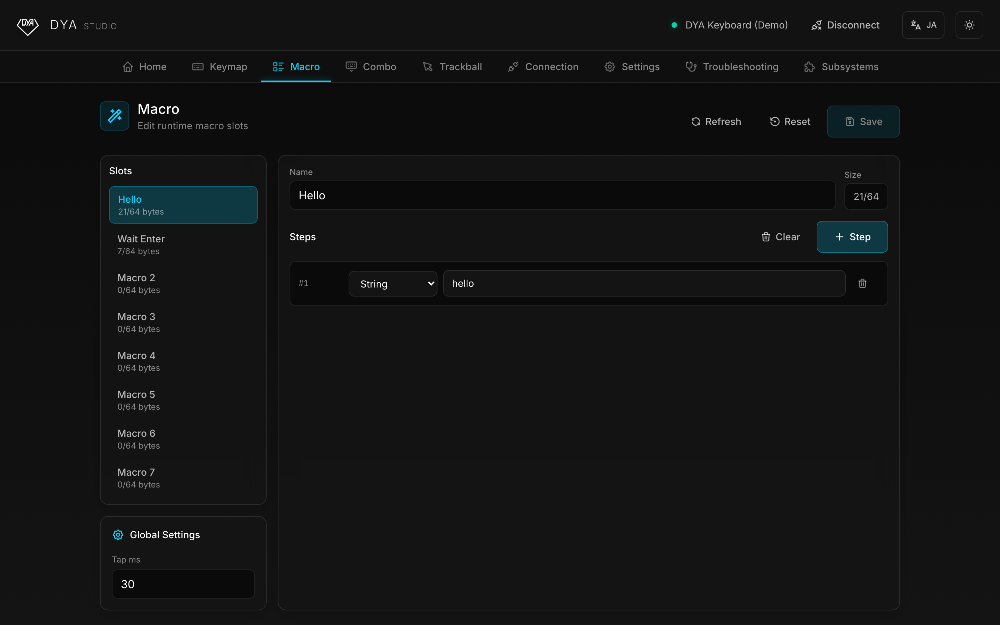
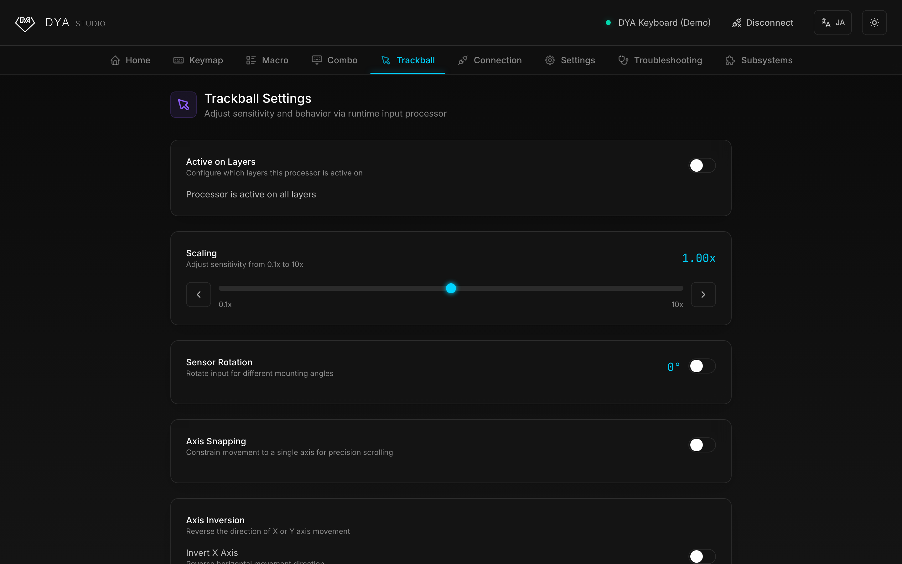
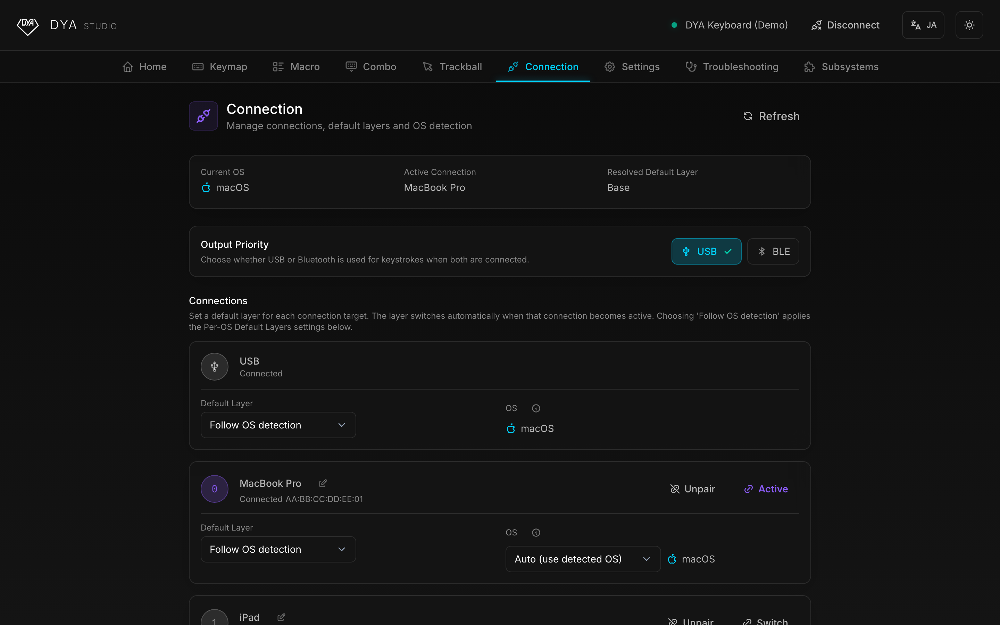
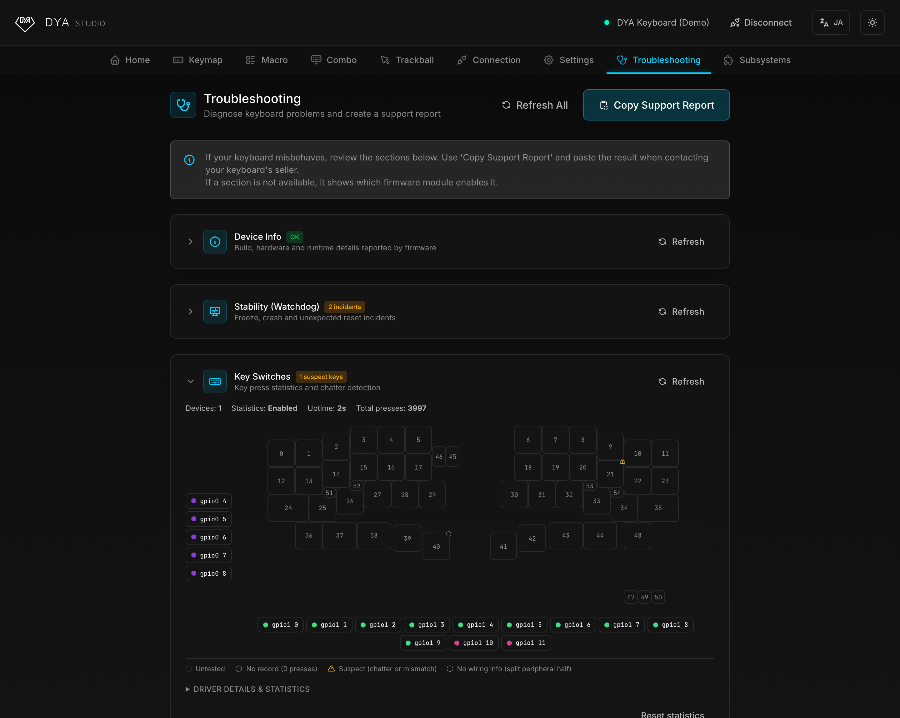

<p align="center">
  
</p>

<h1 align="center">DYA Studio</h1>

<p align="center">
  A web-based configuration tool for the <strong>DYA keyboard series</strong> and ZMK keyboards.<br />
  Tune your keymap, trackball, and connections — right from your browser. No install required.
</p>

<p align="center">
  <a href="https://studio.dya.cormoran.works"><strong>🚀 Open DYA Studio →</strong></a>
  <br />
  <sub>No keyboard at hand? Hit the <em>Demo</em> button on the splash screen to explore every feature with a simulated keyboard.</sub>
</p>

<p align="center">
  
</p>

## Getting Started

1. Open [studio.dya.cormoran.works](https://studio.dya.cormoran.works) in a supported browser (see below).
2. Choose how to connect on the splash screen:
   - **USB** — plug in your keyboard and pick its serial port.
   - **Bluetooth** — pair and connect over BLE.
   - **Demo** — no device needed; explore the app with a simulated keyboard.
3. Configure away. Changes marked as unsaved can be saved to the keyboard's flash so they persist across reboots.

> [!TIP]
> The UI is available in **English** and **日本語** — use the language toggle in the top-right corner.

### Supported browsers

| Platform                                                                       | USB (Web Serial) | Bluetooth (Web Bluetooth) |
| ------------------------------------------------------------------------------ | ---------------- | ------------------------- |
| Chrome / Edge (desktop)                                                        | ✅               | ✅                        |
| Android (Chrome)                                                               | ❌               | ✅                        |
| iOS ([Bluefy](https://apps.apple.com/app/bluefy-web-ble-browser/id1492822055)) | ❌               | ✅                        |
| Firefox / Safari                                                               | ❌               | ❌                        |

## Features

### ⌨️ Keymap Editor

Edit key bindings and layers with a visual editor — equivalent to [ZMK Studio](https://zmk.studio/), with a slightly easier UI. Add, reorder, rename, and delete layers, and watch key presses stream live from the keyboard.

### 📋 Macros & Combos

Create and edit macros and combos at runtime, without rebuilding firmware.

<p align="center">
  
</p>

### 🎯 Trackball Tuning

Adjust the embedded trackball in real time: pointer sensitivity (0.1×–10×), sensor rotation for different mounting angles, axis snapping, scroll behavior, and automatic layer switching — all per input processor, scoped to the layers you choose.

<p align="center">
  
</p>

### 📶 Connection Management

Name, switch, and unpair BLE profiles. Choose whether USB or Bluetooth wins when both are connected. See which OS each host is detected as, override it per profile, and set a default layer per connection target or per OS — the keyboard switches layers automatically when you switch devices.

<p align="center">
  
</p>

### ⚙️ Device Settings

Tweak power management (idle and deep-sleep timeouts) for each half of the keyboard or all devices at once, and edit advanced firmware settings directly from the browser.

### 🩺 Troubleshooting & Diagnostics

Inspect battery levels, firmware build info, and uptime for both halves. Hunt down key chatter with the interactive key-switch diagnostics view, watch the trackball sensor's raw surface frames, and copy a full support report to share when asking for help.

<p align="center">
  
</p>

## Does it work with my keyboard?

- **Any ZMK keyboard with [ZMK Studio](https://zmk.dev/docs/features/studio) enabled**: the keymap editor works out of the box.
- **DYA keyboards** (and keyboards built on [cormoran's ZMK fork + modules](https://github.com/cormoran)): everything above — trackball tuning, connection management, per-OS default layers, diagnostics, and more.

> [!WARNING]
> cormoran's ZMK fork is experimental and optimized for DYA keyboards. It may contain unstable or breaking changes — use it with other keyboards at your own risk.

## The DYA Keyboard Series

| Keyboard     | Description                                                     | Links                                                                                                                                                               |
| ------------ | --------------------------------------------------------------- | ------------------------------------------------------------------------------------------------------------------------------------------------------------------- |
| **DYA Dash** | 40% split keyboard with embedded trackball, for mobile use      | [Design](https://github.com/cormoran/dya-dash-keyboard) · [Docs](https://cormoran.github.io/dya-dash-keyboard/) · [Buy](https://cormoran707.booth.pm/items/6913095) |
| **DYA2**     | Next-gen 60% split, standard row-staggered layout — coming soon | [Booth](https://cormoran707.booth.pm/items/7627440)                                                                                                                 |

Follow [#dya_kbd](https://x.com/search?q=%23dya_kbd) on X, or reach the maintainer [@cormoran707](https://x.com/cormoran707).

## Development

**Stack**: React 19, TypeScript, Vite, Tailwind CSS v4, Radix UI

```bash
git clone https://github.com/cormoran/dya-studio.git
cd dya-studio
npm install
npm run dev            # Start dev server at http://localhost:5173
```

```bash
npm run build          # Production build
npm run lint           # Lint code
npm test               # Run tests
npm run test:coverage  # Test coverage
```

- [Development Guide](docs/DEVELOPMENT_GUIDE.md) — design system, component patterns, and implementation guidelines
- [Testing Guide](docs/TESTING_GUIDE.md) — testing patterns and examples

## Acknowledgments

[ZMK Firmware](https://zmk.dev/) • [ZMK Studio](https://zmk.studio/) • [Radix UI](https://www.radix-ui.com/) • [Tabler Icons](https://tabler.io/icons)
